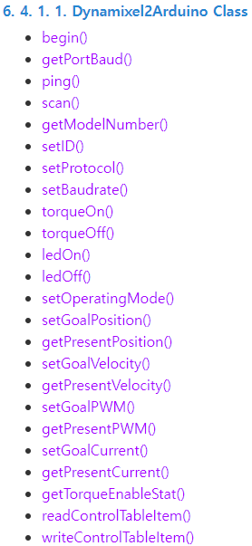
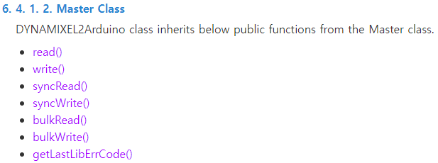
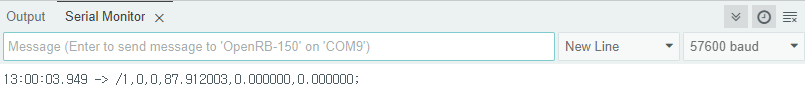
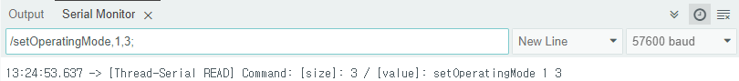
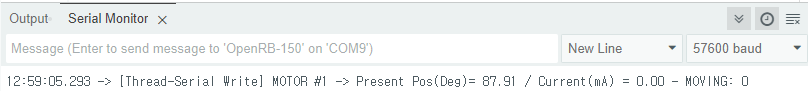
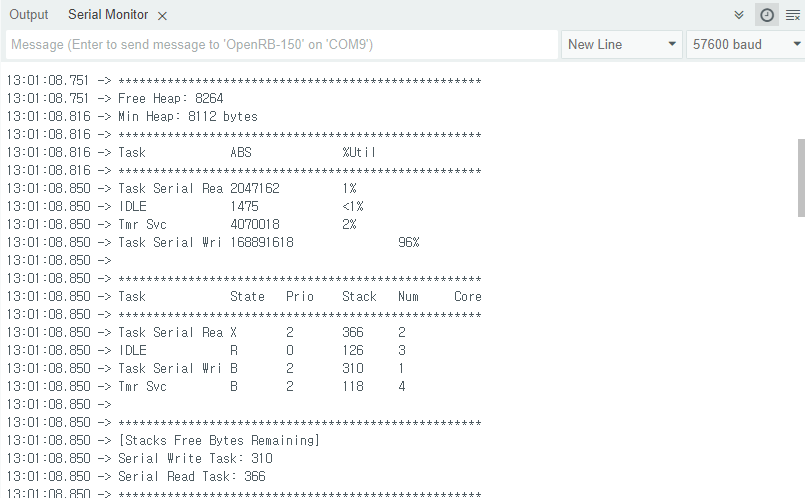

# DYNAMIXEL2Arduino [](https://github.com/ROBOTIS-GIT/Dynamixel2Arduino)


# Summary

This is the Dynamixel motor control code with Dynamixel2Arduino API on RTOS system.

It consist of 2 thread, serial-write & serial-read.

You can publish the command with arguments as string, and subscribe the motor states from OpenRB-150.

# Environments

- MCU : OpenRB-150

- Arduino IDE (2.3.2)

- Library
  > Dynamixel2Arduino (0.7.0)
  
  > FreeRTOS_SAMD21 (2.3.0)

# Protocol of serial-communication

- STX → '/'
- CTX → ';'
- split → ','
- Substances
    - Read  (PC to MCU) : Function name and its arguments
    - Write (MCU to PC) : motor state</br>
      (/ID, hardware_error, Moving, PresentPosition, PresentVelocity, PresentCurrent;)

# Description

- **Serial Write**
  
  MCU(OpenRB-150) send the motor states by serial-communication
  
  - Normal mode - using ```readControlTableItem()``` from Dynamixel2Arduino API.
  - Sync mode - using ```SyncRead()``` from Dynamixel2Arduino API.

- **Serial Read**

  MCU(OpenRB-150) receive the protocol by serial-communication

  - Normal mode & Sync mode are the same
  - You can send command one by one, or send tehm all at once(syncWrite()).


# Code

### Normal mode 
`Serial read` use Dynamixel2Arduino class member function (using **readControlTableItem** API)

> ### Demo
> 👉🏻 [code] (https://github.com/Bigyuun/Dynamixel2Arduino-RTOS/blob/master/examples/RTOS/RTOS_readControlTableItem/RTOS_readControlTableItem.ino)
> 
> ### configuration 
> - RTOS_readControlTableItem.ino
> - definition.hpp
>
> 
https://emanual.robotis.com/docs/en/parts/controller/openrb-150/
---

### Sync mode & Fast Sync mode
`Serial read` use Dynamixel2Arduino Master class member > function
> 
> ### Demo
>
> - **Sync mode (read)**
> 
>   👉🏻 [code] (https://github.com/Bigyuun/Dynamixel2Arduino-RTOS/blob/master/examples/RTOS/RTOS_sync_read/RTOS_sync_read.ino)
> 
> - **Fast Sync mode (read)**
> 
>   👉🏻 [code] (https://github.com/Bigyuun/Dynamixel2Arduino-RTOS/blob/master/examples/RTOS/RTOS_sync_read/RTOS_fast_sync_read.ino)
>
> - **Sync mode (read & write)**
> 
>   👉🏻 [code] (https://github.com/Bigyuun/Dynamixel2Arduino-RTOS/blob/master/examples/RTOS/RTOS_sync_read/RTOS_sync_read_write.ino)
>
> - **Fast Sync mode (read & write)**
> 
>   👉🏻 [code] (https://github.com/Bigyuun/Dynamixel2Arduino-RTOS/blob/master/examples/RTOS/RTOS_sync_read/RTOS_fast_sync_read_write.ino)
> 
> ### configuration
> 
>   - RTOS_sync_read.ino
>   - definition.hpp
>   - control_table.hpp
> 
>   
https://emanual.robotis.com/docs/en/parts/controller/openrb-150/


# Usage
### Serial Write (MCU to PC)

- **Form**  
  /motor_id, errcode, MOVING, PresentPosition(degree), PresentVelocity, PresentCurrent;
  
  → e.g. /1,0,0,87.912003,0.000000,0.000000;
    
    
    

### Serial Read (PC to MCU)

- **Form**
  
  /Function name(Dynamixel2Arduino), arg1, arg2, ...;

- **Dynamixel2Arduino API**
    - For using ‘dxl.setOperatingMode(1, OP_POSITION)’

      → /setOperatingMode,1,3;
    
      

    - Sync Write Function

      → /syncWrite,{target_name},{target_value_of_motor_#1},{target_value_of_motor_#2}, ... ; 

      e.g. /syncWrite,poisition,1000,3000;

    - Torque On & Off of all motors
      
      → /torqueOnAll;

      → /torqueOffAll;


- **Other custom function**

    - Monitoring as protocol
      
      If you want to see without protocol, you can send 
      
      → /monitorOn;
        
        
        
    - Monitoring as User
    
      Else if you want to see the motor states with protocol, you can send
      
      → /monitorOff;
        
        
        
    - Task information
      
      If you want to check the task information about each multi-thread, you can send
      
      → /task;
        
        


## Serial and Direction Pin definitions of ROBOTIS controllers
 - When running DYNAMIXEL without DYNAMIXEL Shields on OpenCM9.04, OpenCR or custom boards, you might need to change the Serial and DYNAMIXEL Direction Pin.
 - We provide the information below to make it easier to define Serial and Direction pins for specific hardware.

    |Board Name|Serial|Direction Pin|Note|
    |:-:|:-:|:-:|:-:|
    |OpenCM9.04|Serial1|28|Uploading Arduino Sketch will erase the factory firmware. The firmware can be recovered with DYNAMIXEL Wizard 2.0|
    |OpenCM485EXP|Serial3|22||
    |OpenCR|Serial3|84|OpenCR has an FET switch to control power supply to DYNAMIXEL. ([Reference link](https://github.com/ROBOTIS-GIT/OpenCR/blob/master/arduino/opencr_arduino/opencr/libraries/DynamixelSDK/src/dynamixel_sdk/port_handler_arduino.cpp#L78))|
    |OpenRB-150|Serial1|(-1)Automatic|-|


## How to add new DYNAMIXEL model.
 - For the convenience of the user, Dynamixel2Arduino API hardcodes some information in the control table and stores it in flash.
 - To do this, you need to add code to some files. In this regard, please refer to [PR#3](https://github.com/ROBOTIS-GIT/Dynamixel2Arduino/pull/3) and [PR#7](https://github.com/ROBOTIS-GIT/Dynamixel2Arduino/pull/7)

## How to create custom PortHandler Class
 - Please refer to [port_handler.h](https://github.com/ROBOTIS-GIT/Dynamixel2Arduino/blob/master/src/utility/port_handler.h)
 - Create a new class by inheriting PortHandler as public. (Like SerialPortHandler and USBSerialPortHandler)
